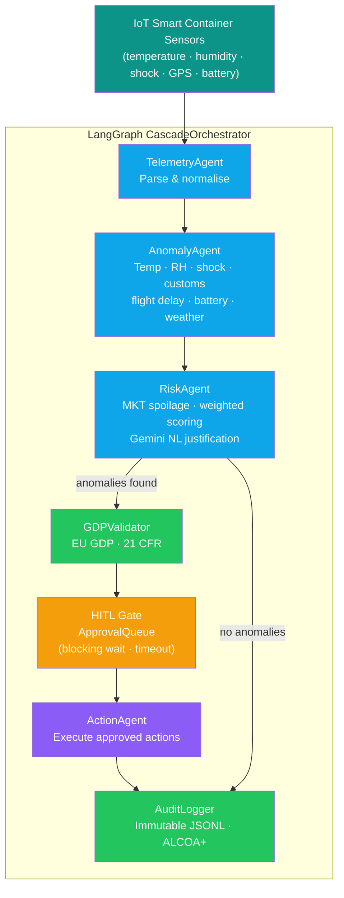
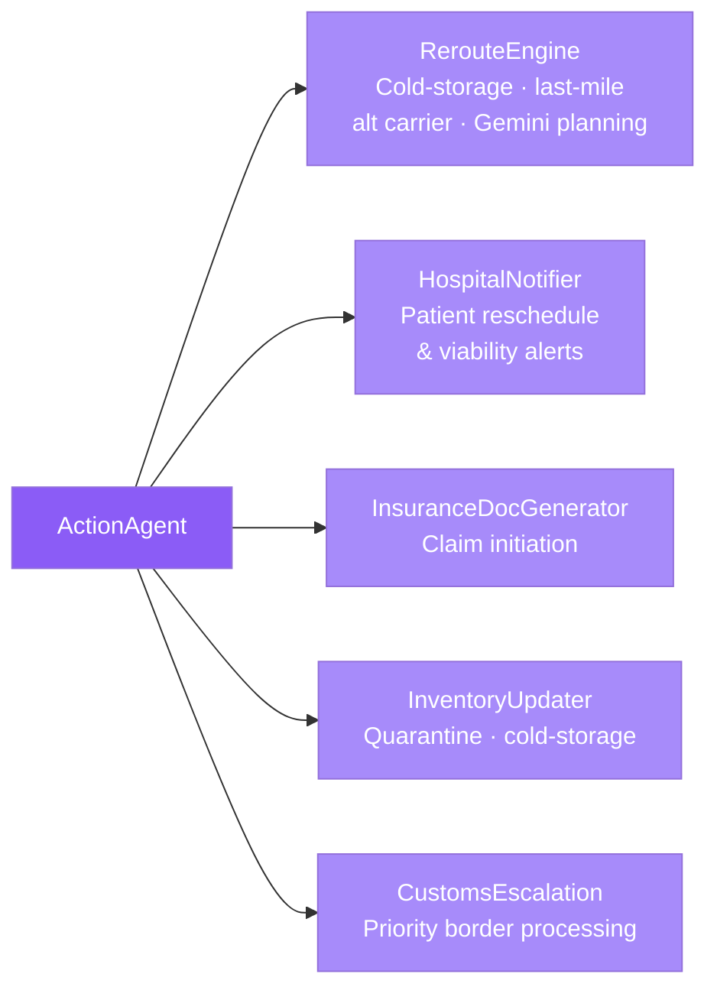
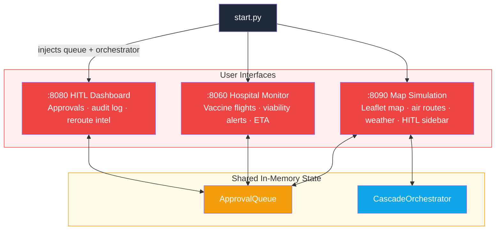

# Pharma Cargo Monitor

### Team Terp Agents
### Team Members - Sahil Chordia · Harsh Shrishrimal · Rishika Thakre · Rishabh Ranka

*UMD Agentic AI Challenge 2026 : Cargo Monitoring Track*

> An agentic AI system for real-time pharmaceutical cold-chain monitoring. Autonomous agents detect anomalies in IoT telemetry from smart containers, assess risk of spoilage or delay, and trigger cascading operational actions, all with GDP/FDA-compliant audit trails and human-in-the-loop oversight.

---

## Architecture

### Agent Pipeline



### Cascading Actions & Downstream Systems



### Deployment (3 servers, 1 shared queue)



---

## System Overview

| Layer | Components | Role |
|-------|-----------|------|
| **Ingestion** | `TelemetryAgent` | Parse, normalise, and historise raw IoT payloads into typed `TelemetryRecord` objects |
| **Detection** | `AnomalyAgent` | Product-aware detection: temperature, humidity, shock, customs hold, flight delay, battery, severe weather |
| **Assessment** | `RiskAgent` | MKT-based spoilage probability, weighted multi-factor scoring (0–1), Gemini NL justification |
| **Compliance** | `GDPValidator` | EU GDP 2013/C 343/01 and 21 CFR Part 211/600 with citation-level traceability |
| **HITL** | `ApprovalQueue` | Thread-safe blocking queue with timeout, partial approval, operator notes |
| **Actions** | `ActionAgent` | Cascading dispatch: reroute, hospital alerts, insurance, inventory quarantine, customs |
| **Reroute** | `RerouteEngine` | Cold-storage / last-mile / original-route evaluation against product time-to-spoilage |
| **Notifications** | `HospitalNotifier` · `InsuranceDocGenerator` · `InventoryUpdater` | HTTP webhook integrations |
| **Audit** | `AuditLogger` | Append-only JSONL trail (ALCOA+) for every event in the pipeline |
| **Orchestration** | `CascadeOrchestrator` | LangGraph `StateGraph` with conditional routing |
| **Simulation** | `StreamSimulator` · `map_sim` | CLI synthetic telemetry and interactive Leaflet map with physics-based cold-chain model |

---

## Project Structure

```
pharma-cargo/
├── agents/
│   ├── telemetry_agent.py        # IoT payload ingestion & history
│   ├── anomaly_agent.py          # Product-aware anomaly detection
│   ├── risk_agent.py             # MKT spoilage, risk scoring, Gemini justification
│   ├── action_agent.py           # Cascading action dispatcher
│   ├── reroute_engine.py         # Multi-path reroute planning
│   └── cascade_orchestrator.py   # LangGraph pipeline
├── hitl/
│   ├── approval_queue.py         # Thread-safe HITL queue
│   ├── dashboard.py              # Operator dashboard (FastAPI)
│   ├── hospital_dashboard.py     # Hospital vaccine logistics monitor (FastAPI)
│   └── sea_routes.py             # Maritime route helper
├── compliance/
│   ├── audit_logger.py           # Append-only JSONL audit trail
│   └── gdp_rules.py              # GDP / 21 CFR validation rules
├── notifications/
│   ├── hospital_notifier.py      # Hospital webhook alerts
│   ├── insurance_docs.py         # Insurance claim documents
│   └── inventory_updater.py      # Inventory / cold-storage updates
├── simulation/
│   └── stream_simulator.py       # Synthetic telemetry generator
├── map_sim/
│   ├── app.py                    # Air-route simulation (FastAPI)
│   └── static/                   # Leaflet map UI
├── map_sim_ship/                 # Maritime simulation variant
├── data/
│   ├── raw/                      # Product catalogue, carriers, airports, CSVs
│   ├── processed/                # audit.jsonl output
│   ├── dataset_loader.py         # Carrier & shipment data loaders
│   └── product_catalogue.py      # ProductProfile dataclass & loader
├── mock_services/                # Mock HTTP endpoints for notifications
├── tests/
│   └── test_agents.py            # Pytest suite
├── config.py                     # Thresholds, risk weights, API keys
├── main.py                       # CLI entry point
├── start.py                      # One-command launcher (3 servers, 1 queue)
└── requirements.txt
```

---

## Quick Start

```bash
pip install -r requirements.txt        # 1. Install dependencies
echo GEMINI_API_KEY=your-key > .env    # 2. (Optional) enable Gemini NL justifications
python start.py                        # 3. Launch all services
```

| Service | URL | Purpose |
|---------|-----|---------|
| HITL Dashboard | http://localhost:8080 | Operator approvals, audit log, reroute intelligence |
| Hospital Monitor | http://localhost:8060 | Vaccine flight tracking, viability alerts, ETA |
| Map Simulation | http://localhost:8090 | Interactive Leaflet map, air routes, weather, HITL sidebar |

**Alternative commands:**

```bash
python main.py test-pipeline                       # Smoke test
python main.py simulate --shipments 3 --ticks 20   # CLI simulation
python main.py dashboard --port 8080               # Dashboards only
pytest tests/ -v                                   # Run tests
```

---

## Key Features

| Feature | Detail |
|---------|--------|
| Product-aware anomaly detection | Thresholds loaded per product from catalogue (50+ pharma products) |
| Physics-based cold-chain sim | Battery → cooling effectiveness → ambient drift model |
| MKT spoilage model | Time-weighted Arrhenius-based Mean Kinetic Temperature |
| Multi-path reroute | Cold-storage, last-mile courier, original-route evaluated against time-to-spoilage |
| Human-in-the-loop | Thread-safe queue, partial approval, timeout, operator notes |
| Hospital dashboard | Inbound vaccine flights, viability alerts, temperature stats |
| GDP/FDA compliance | EU GDP 2013/C 343/01 · 21 CFR 211.68 · 21 CFR 600.15 |
| ALCOA+ audit trail | Immutable append-only JSONL, queryable by shipment or event type |
| Gemini integration | Optional NL risk justifications and reroute planning narratives |
| LangGraph orchestration | Conditional routing, clean ticks short-circuit to audit |

---

## Configuration

All thresholds in `config.py`. Key parameters:

```python
TEMP_MIN_C, TEMP_MAX_C         # Default cold-chain bounds (overridden per product)
HUMIDITY_MAX_PCT = 75.0        # %RH maximum
SHOCK_MAX_G = 3.0              # g maximum
EXCURSION_MINUTES = 30         # Sustained excursion trigger
RISK_HIGH_THRESHOLD = 0.70
HITL_APPROVAL_TIMEOUT_SEC = 300
```

Set `GEMINI_API_KEY` in `.env` for Gemini-powered justifications.
